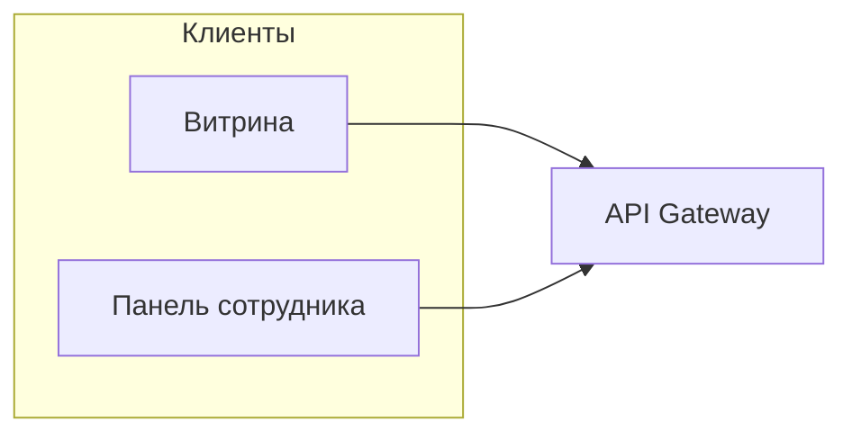
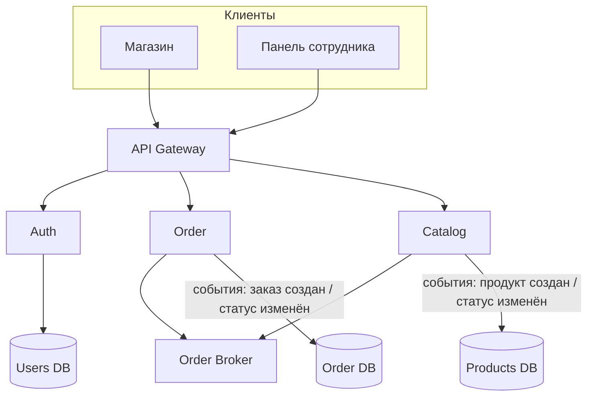

# Высокоуровневая архитектура (HLA): магазин лампочек

Магазин реализован на основе микросервисной архитектуры.

## Принципы

- **Доменные границы**: **Auth** владеет пользователями, **Catalog** — каталогом и остатками, **Order** — заказами; связи между доменами — через API и **Order Broker** (события о продуктах и заказах).
- **Gateway**: единая точка входа для веб-клиентов; аутентификация (проверка JWT) и маршрутизация к **Auth**, **Catalog** и **Order**.
- **Order Broker**: асинхронные уведомления (например, «продукт создан / статус изменён», «заказ создан / статус изменён») для слабой связанности **Catalog** и **Order**.
- **Масштабирование**: независимо нагружаемые части — каталог и чтение витрины чаще, чем оформление заказа.

## Состав сервисов

| Узел | Ответственность | Хранилище (пример) |
|------|-----------------|---------------------|
| **API Gateway** | TLS, лимиты, маршрутизация, проверка JWT | — |
| **Auth** | Регистрация, вход для сотрудника | **Users DB** |
| **Catalog** | Категории ламп, карточки товара, цена, остаток | **Products DB** |
| **Order** | Оформление заказа, позиции со снимком цены, статусы, доставка/самовывоз | **Order DB** |
| **Order Broker** | Публикация/потребление событий между **Catalog** и **Order** | — |

Оркестрация: **Order** при создании заказа согласуется с **Catalog** (цены/наличие); **Catalog** и **Order** публикуют изменения в **Order Broker** и фиксируют состояние в своих БД (на диаграмме — связь с **Products DB** и **Order DB** через поток событий/данных).

## Диаграмма контекста (клиенты и шлюз)

## Диаграмма микросервисов и потоков

