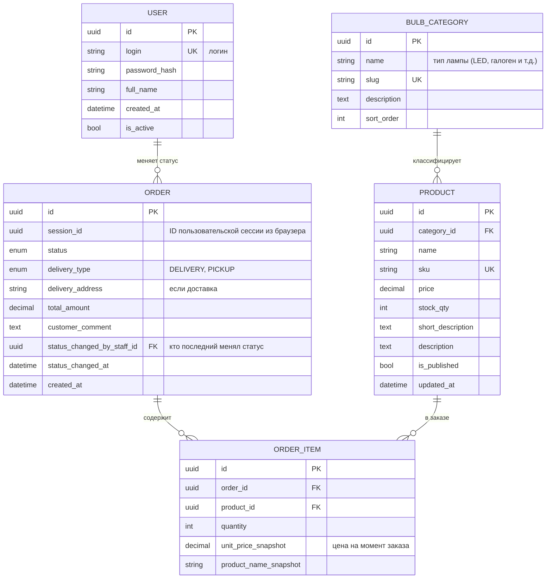

# Интернет-магазин лампочек — концептуальная модель данных

Краткое описание домена:

| Область | Содержание |
|--------|------------|
| **Товары** | Ассортимент лампочек; типы/категории вынесены в справочник (сейчас ~20 позиций, список расширяемый без смены схемы). |
| **Заказы** | Корзина пользователя → оформление заказа; список заказов в личном кабинете. |
| **Доставка** | Способ: доставка или самовывоз; оплата при получении (наложенный платёж / оплата курьеру или в пункте выдачи). |
| **Авторизация** | Учётные записи покупателей; роли для доступа к панели управления. |
| **Панель управления** | Сотрудник вручную переводит заказ по статусам (workflow заказа). |

Схема данных:

## Связи и правила (логика)

- **Типы ламп** (`BULB_CATEGORY`) — отдельная сущность: при росте ассортимента добавляются строки, а не новые таблицы.
- **Заказ** — копирует цену и наименование в `ORDER_ITEM` (снимок), чтобы история не «поехала» при смене цены карточки товара.
- **Статус заказа** меняется сотрудником из панели; поля `status_changed_by_staff_id` и `status_changed_at` фиксируют аудит.
